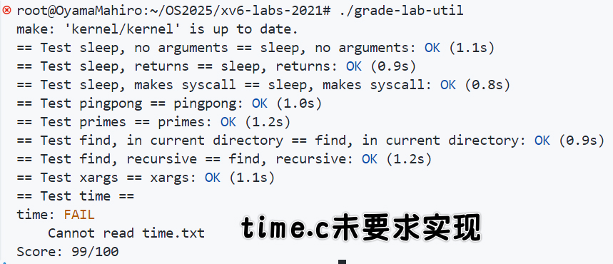

# **华东师范大学数据学院上机实践报告**

# OS Lab1实验报告

| 课程名称： 操作系统             | 年级：2023            | 上机实践成绩：            |
| :------------------------------ | --------------------- | ------------------------- |
| **指导老师**：翁楚良            | **姓名**：陈子谦      |                           |
| **上机实践名称**：xv6-labs-2021 | **学号**：10235501454 | **上机实践日期**：25.2.28 |

## 一、实验目的
1. 掌握UNIX系统调用和文件系统的操作方式
2. 理解进程间通信(IPC)机制与管道(Pipe)的应用
3. 实践递归算法在文件系统遍历中的应用
4. 学习多进程协作处理数据的编程模式
5. 实现命令行工具的参数处理与标准输入解析
6. 加深对进程创建(fork)、执行(exec)、等待(wait)机制的理解

## 二、实验内容
1. **sleep.c**：实现指定时间的睡眠功能
2. **pingpong.c**：通过管道实现父子进程间的双向通信
3. **primes.c**：使用管道和递归实现求取指定范围内的质数
4. **find.c**：递归遍历目录树查找指定文件
5. **xargs.c**：从标准输入读取参数并执行指定命令

## 三、使用环境
- **操作系统**: xv6教学操作系统
- **开发工具**: GCC编译器、Make构建工具
- **硬件环境**: QEMU虚拟机模拟的RISC-V架构
- **编程语言**: C语言（受限的xv6环境版本）

## 四、实验过程及结果

### 1. sleep.c

这个实验的目的实现xv6的UNIX程序**`sleep`**：**`sleep`**应该暂停到用户指定的计时数。一个滴答(tick)是由xv6内核定义的时间概念，即来自定时器芯片的两个中断之间的时间。

#### **实现思路**

- 解析命令行参数验证有效性（argc == 2）
- 调用系统级sleep函数实现定时
- 处理错误输入（time < 0）和边界情况

#### **代码**

```c
#include "kernel/types.h"
#include "user/user.h"

int
main(int argc, char *argv[])
{
    if(argc != 2){
        fprintf(2, "usage: sleep [n] seconds\n");
        exit(1);
    }
    int time = atoi(argv[1]);
    if (time <= 0) {
        fprintf(2, "sleep: invalid time\n");
        exit(1);
    }
    sleep(time);
    exit(0);
}
```

#### **测试结果**

```bash
$ sleep 10
(等待10秒后程序退出)
```

### 2. pingpong.c

#### **实现逻辑**

- 首先创建两个管道实现双向通信（parent_fd & child_fd）并fork子进程
- 父进程先发送"1"到子进程
- 子进程接收后打印"[child_PID] received ping"
- 子进程返回"1"后父进程打印"[parent_PID] received pong"

**管道结构**

```
父进程   子进程
[写] --> [读]
[读] <-- [写]
```

#### pipe

最开始没有太理解管道的概念上网搜了一下，大概是这样：管道是两个进程之间的连接，使得一个进程的标准输出成为另一个进程的标准输入。在 UNIX 操作系统中，管道可用于相关进程之间的通信（进程间通信）。

- 管道是单向通信，即我们可以使用管道，一个进程写入管道，另一个进程从管道读取。它打开一个管道，它是主内存的一个区域，被视为***“虚拟文件”\***。
- 创建进程及其所有子进程均可使用管道进行读写。一个进程可以向此“虚拟文件”或管道写入数据，而另一个相关进程可以从中读取数据。
- 如果某个进程在将内容写入管道之前尝试进行读取，则该进程将被暂停，直到写入内容为止。
- pipe 系统调用在进程的打开文件表中找到前两个可用位置，并将它们分配给管道的读写端。

并且，管道的行为符合**FIFO**（先进先出）原则，管道的行为类似于队列


#### 代码

```c
#include "kernel/types.h"
#include "kernel/stat.h"
#include "user/user.h"

int
main(int argc, char *argv[])
{
    int parent_fd[2], child_fd[2];
    pipe(parent_fd);
    pipe(child_fd);
    if(fork() == 0) {
        read(parent_fd[0], "ping", 1);
        printf("%d: received ping\n", getpid());
        write(child_fd[1], "1", 1);
        exit(0);
    } else {
        write(parent_fd[1], "1", 1);
        read(child_fd[0], "pong", 1);
        printf("%d: received pong\n", getpid());
    }
    exit(0);
}
```

#### **运行结果**

```
4: received ping
3: received pong
```

在网上查的过程还看到另一张图如下：


及父进程和子进程可以共用一个管道，但要注意wait防止堵塞，按照这个思路实现如下：

```c
#include "kernel/types.h"
#include "kernel/stat.h"
#include "user/user.h"

#define NULL ((void*)0)  // 手动定义 NULL
#define MSGSIZE 16

int main(void) {
    int fd[2];
    char buf[MSGSIZE];
    pipe(fd);
    int pid = fork();
    if (pid > 0){
        write(fd[1],"ping",MSGSIZE);
        wait(NULL);
        read(fd[0], buf, MSGSIZE);
        fprintf(2,"%d: received %s\n",getpid(), buf);
    } else {
        read(fd[0], buf, MSGSIZE);
        printf("%d: received %s\n",getpid(), buf);
        write(fd[1],"pong", MSGSIZE);
    }
    exit(0);
}
```

就是需要定义一下NULL，否则wait函数会报错。。。和上一个两个管道能简洁一点，并且还需要注意./grade-lab-util需要的输出一定为`%d: received %s`，不然测试无法通过。

两种都通过了测试，第二个方法还能快点。

### 3. primes.c

#### **算法实现**

> 最开始采取文档里hints的方法去构建了一个prime函数，后不知为什么怎么修改都出现无限递归的问题，因而转为使用循环迭代的方法在main函数内编写。

这个实验的目的是使用`pipe`和`fork`来设置管道。第一个进程将数字2到35输入管道。对于每个素数，安排创建一个进程，该进程通过一个管道从其左邻居读取数据，并通过另一个管道向其右邻居写入数据。

通过查了一下参考资料，使用Eratosthenes的筛选法 以下是图片说明的过程


#### **代码**

```c
#include "kernel/types.h"
#include "kernel/stat.h"
#include "user/user.h"

#define READ 0   // 管道读取端索引
#define WRITE 1  // 管道写入端索引

int main(int argc, char *argv[]) {
    int p[2];
    pipe(p);
    
    if (fork() > 0) {
        close(p[READ]);  // 父进程只写入，不需要读取端
        
        // 向管道写入2到35的所有整数
        for (int i = 2; i <= 35; i++) {
            write(p[WRITE], &i, sizeof(i));
        }
        
        close(p[WRITE]);  // 没有其他数据写入需求，关闭写入端
        wait(0);
        exit(0);
    }
    
    // 以下是筛选质数的过程，每个进程处理一个质数
    int left_read = p[READ];  // 保存当前读取端
    close(p[WRITE]);  // 子进程只读取，关闭写入端
    
    int prime;  // 存储当前找到的质数
    int right_pipe[2];  // 用于向下一个进程传递数据的管道
    
    while (read(left_read, &prime, sizeof(prime)) > 0) {
        printf("prime %d\n", prime);  // 输出找到的质数(注意与grade-lab-util所需格式相同)
        
        pipe(right_pipe);  // 创建新管道用于传递筛选后的数据
        
        if (fork() == 0) {
            // 子进程将成为下一个筛选器
            close(right_pipe[WRITE]);  // 子进程只读取
            close(left_read);  // 关闭旧管道读取端，防止堵塞
            left_read = right_pipe[READ];  // 更新左管道为右管道
            continue;
        }
        
        // 父进程筛选数据并传递给子进程
        close(right_pipe[READ]);  // 父进程只写入
        int num;
        
        // 读取所有剩余数字并筛选
        while (read(left_read, &num, sizeof(num)) > 0) {
            if (num % prime != 0) {
                write(right_pipe[WRITE], &num, sizeof(num));  // 如果不能被当前质数整除，则传递给下一个进程
            }
        }
        
        close(left_read);
        close(right_pipe[WRITE]);
        
        wait(0);
        exit(0);
    }
    
    close(left_read);
    exit(0);
}
```

#### **输出**

```
prime 2
prime 3
prime 5
...
prime 31
```

### 4. find.c
#### 设计思路

这个的实验目的是写一个简化版本的UNIX的`find`程序：查找目录树中具有特定名称的所有文件

思路主要是这三点

- 查看***user/ls.c\***文件学习如何读取目录
- 使用递归允许`find`下降到子目录中
- 不要在“`.`”和“`..`”目录中递归

整体的代码还是在ls.c的基础上进行修改的

#### 代码

```c
#include "kernel/types.h"
#include "kernel/stat.h"
#include "user/user.h"
#include "kernel/fs.h"

void find(char *path, char *filename)
{
  char buf[512], *p;  // 缓冲区用于构建完整路径
  int fd;  // 文件描述符
  struct dirent de;  // 目录项结构体
  struct stat st;  // 文件状态结构体

  // 打开目录
  if((fd = open(path, 0)) < 0){
    fprintf(2, "find: cannot open %s\n", path);
    return;
  }

  // 获取文件状态
  if(fstat(fd, &st) < 0){
    fprintf(2, "find: cannot stat %s\n", path);
    close(fd);
    return;
  }

  // 确保path是一个目录
  if(st.type != T_DIR){
    fprintf(2, "find: %s is not a directory\n", path);
    close(fd);
    return;
  }

  // 检查路径长度以防缓冲区溢出
  if(strlen(path) + 1 + DIRSIZ + 1 > sizeof buf){
    fprintf(2, "find: path too long\n");
    close(fd);
    return;
  }

  // 构建基本路径（以'/'结尾）
  strcpy(buf, path);
  p = buf+strlen(buf);
  *p++ = '/';

  // 读取目录中的所有条目
  while(read(fd, &de, sizeof(de)) == sizeof(de)){
    // 跳过无效项
    if(de.inum == 0)
      continue;

    // 构建完整路径（目录+文件名）
    memmove(p, de.name, DIRSIZ);
    p[DIRSIZ] = 0;  // 确保字符串结束

    // 获取文件信息
    if(stat(buf, &st) < 0){
      fprintf(2, "find: cannot stat %s\n", buf);
      continue;
    }

    // 如果是文件且名称匹配，输出路径
    if(st.type == T_FILE && strcmp(de.name, filename) == 0){
      printf("%s\n", buf);
    }
    // 如果是目录且不是"."或".."，递归查找
    else if(st.type == T_DIR && strcmp(de.name, ".") != 0 && strcmp(de.name, "..") != 0){
      find(buf, filename);  // 递归搜索子目录
    }
  }
  
  close(fd);  // 关闭目录
}

int main(int argc, char *argv[])
{
  // 检查参数数量
  if(argc != 3){
    fprintf(2, "Usage: find <directory> <filename>\n");
    exit(1);
  }
  
  find(argv[1], argv[2]);  // 从指定目录开始查找指定文件名
  exit(0);
}
```

### 5. xargs.c
#### 设计思路

这个实验的目的是编写一个简化版UNIX的`xargs`程序：它从标准输入中按行读取，并

且为每一行执行一个命令，将行作为参数提供给命令。

主要的思路就是就是每次从 stdin 中读取一行，然后将其与 xargs 后面的字符串拼起来形成一个命令，fork 出一个子进程并交给 exec 来执行。程序通过 read_line 函数从标准输入读取数据。read_line 会逐字节读取输入内容，跳过空格和制表符，找到非空白字符开始一个参数。遇到空格或制表符时，它认为这个参数已经结束，将其存储在 args 数组中。每当遇到换行符时，表示该行输入结束，read_line 返回 1，表明读取成功。如果读取到文件末尾，函数返回 0。

读取到完整的一行参数后，程序使用 fork() 创建子进程，然后在子进程中使用 exec() 来执行命令。exec() 使用 args[] 数组作为命令的参数列表，包含了预定义的命令和从标准输入读取到的参数。父进程等待子进程结束后，继续从输入中读取下一行数据，重复这个过程，直到标准输入结束或没有更多的参数。

#### 代码

```c
#include "kernel/types.h"
#include "kernel/stat.h"
#include "kernel/param.h"
#include "user/user.h"

int read_line(char *buf, int max_len) {
    int i = 0;
    while (i < max_len) {
        // 一次读取一个字符
        if (read(0, buf + i, 1) <= 0) {
            // EOF或错误
            if (i == 0) return 0;  // 没有数据，EOF
            break;
        }
        
        if (buf[i] == '\n') {
            break;  // 读取到换行符，结束当前行
        }
        i++;
    }
    
    buf[i] = '\0';  // 添加字符串结束符
    return i;
}

int parse_args(char *line, char *argv[], int argc) {
    char *p = line;
    int i = argc;  // 从现有参数数量开始追加
    
    while (*p && i < MAXARG - 1) {
        // 跳过前导空格
        while (*p == ' ' || *p == '\t') {
            p++;
        }
        
        if (*p == '\0') break;  // 字符串结束
        
        argv[i++] = p;  // 记录参数起始位置
        
        // 查找参数结束位置
        while (*p && *p != ' ' && *p != '\t') {
            p++;
        }
        
        // 如果没有结束，添加字符串结束符，并移动指针
        if (*p) {
            *p++ = '\0';
        }
    }
    
    argv[i] = 0;  // 参数数组以NULL结尾
    return i;
}

int main(int argc, char *argv[]) {
    char buf[512];
    char *xargs_argv[MAXARG];
    int xargs_argc;
    
    // 检查命令行参数
    if (argc < 2) {
        fprintf(2, "Usage: xargs command [args...]\n");
        exit(1);
    }
    
    // 复制原始命令及其参数
    for (int i = 1; i < argc; i++) {
        xargs_argv[i - 1] = argv[i];
    }
    xargs_argc = argc - 1;
    
    // 逐行读取标准输入，并执行命令
    while (read_line(buf, sizeof(buf)) > 0) {
        // 解析当前行作为附加参数
        xargs_argc = parse_args(buf, xargs_argv, xargs_argc);
        
        // 创建子进程执行命令
        int pid = fork();
        if (pid < 0) {
            fprintf(2, "xargs: fork failed\n");
            exit(1);
        } else if (pid == 0) {
            // 子进程执行命令
            if (exec(xargs_argv[0], xargs_argv) < 0) {
                fprintf(2, "xargs: exec %s failed\n", xargs_argv[0]);
                exit(1);
            }
        } else {
            // 父进程等待子进程完成
            wait(0);
        }
        
        // 重置参数数量为初始命令参数
        xargs_argc = argc - 1;
    }
    
    exit(0);
}
```

## 五、总结

实验全部的测试结果：


